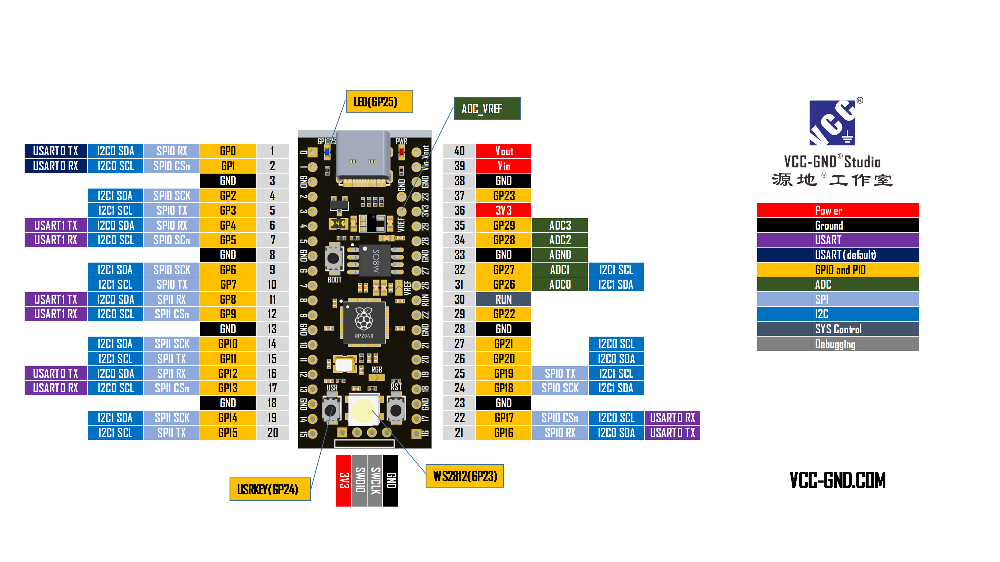

# Night mode with NEOPIXEL

All you need is:
- flash [CircuitPython](https://circuitpython.org/downloads)
- put the [neopixel library](https://circuitpython.org/libraries) in lib folder
- replace code.py that stores on board with that, which placed here (look for your board name)
- connect NEOPIXEL supporting smart LED (W2812)
- change port which connected to NEOPIXELs (there may be nore than 1, much more...)

## YD-RP2040

This plate has W2812 onboard, so you just need to solder or connect any other way 2 contacts above onboard LED

W2812 LED already connected to GP23 port, so you don't need to do anything at first.
